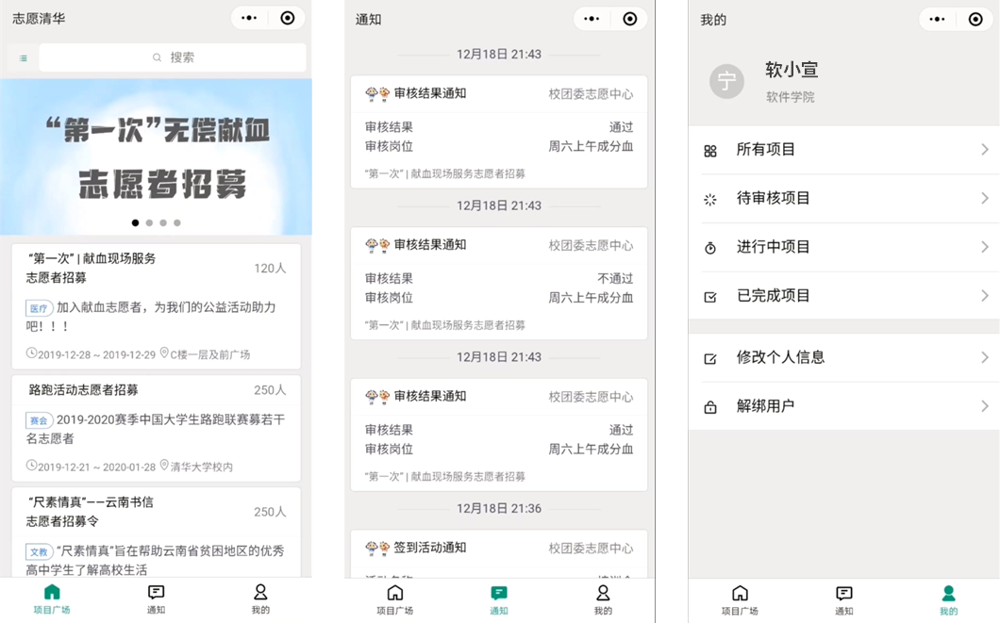

# Volunteer-Tsinghua

[](https://travis-ci.com/LuoBingjun/Volunteer-Tsinghua)

A WeChat miniprogram to provide better service for volunteers & organizers in Tsinghua University, comprised of Django backend, Web frontend and Miniprogram frontend.



## Folders
- backend: backend code
- frontend: miniprogram frontend code
- web: web frontend code
- config: configs for Docker deployment

## Deployment

The project uses Docker for automated deployment. 64-bit Linux server with docker & npm installed is recommended.

### Requirements

- npm(>=3.5.2)
- docker(>=19.03.5)
- docker-compose(>=1.17.1)

### Steps

1. Clone the repository, and enter the root directory of it.

2. Compile web frontend code.

   ```
   cd web && npm install && npm run build:prod
   ```

3. Build backend image.

   ```
   docker-compose build
   ```

4. Configure the project, referring to `Config` part.

5. Start up!

   ```
   docker-compose up
   ```

### Config

All configs are stored in `config/config.env` as environment variables, including settings for database, domains and WeChat SDK. You should modify `config/config.env.example` and resave it as `config/config.env`.

For HTTPS support (optional), you should put the SSL certification keys in `config/ssl/` as `fullchain.pem` and `privkey.pem`.